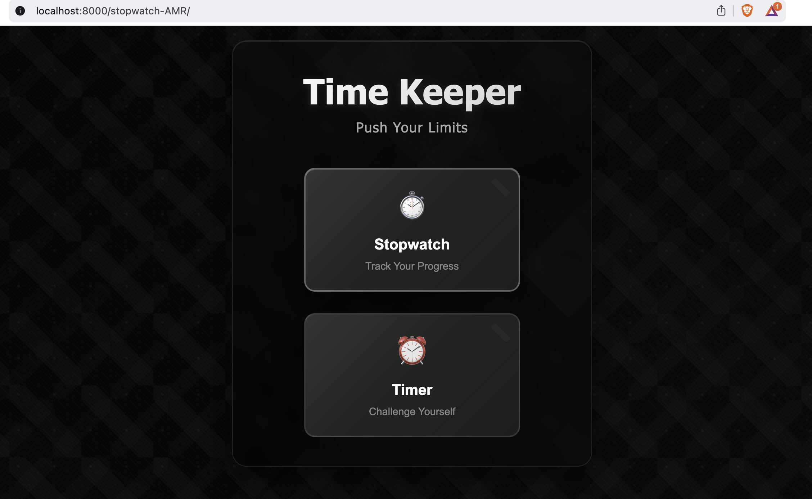
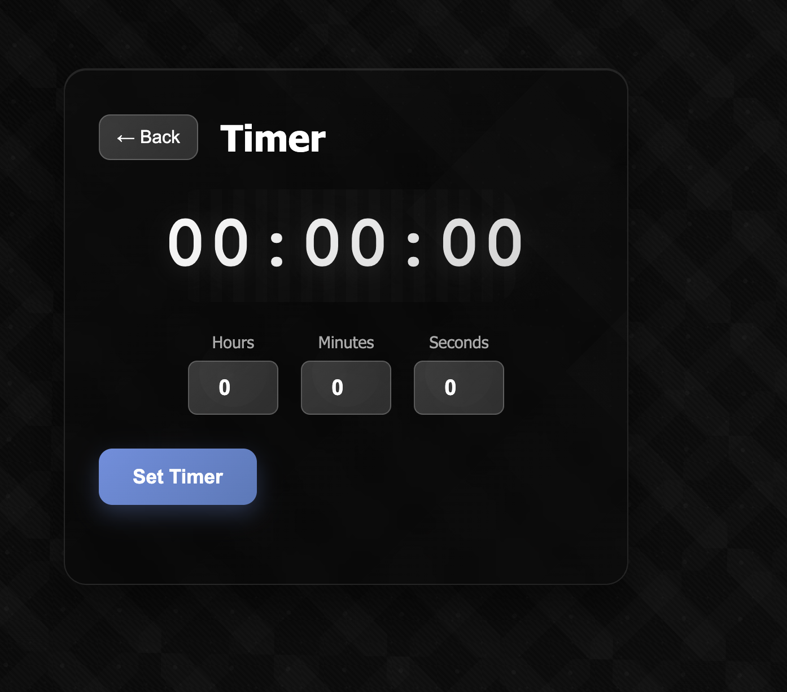
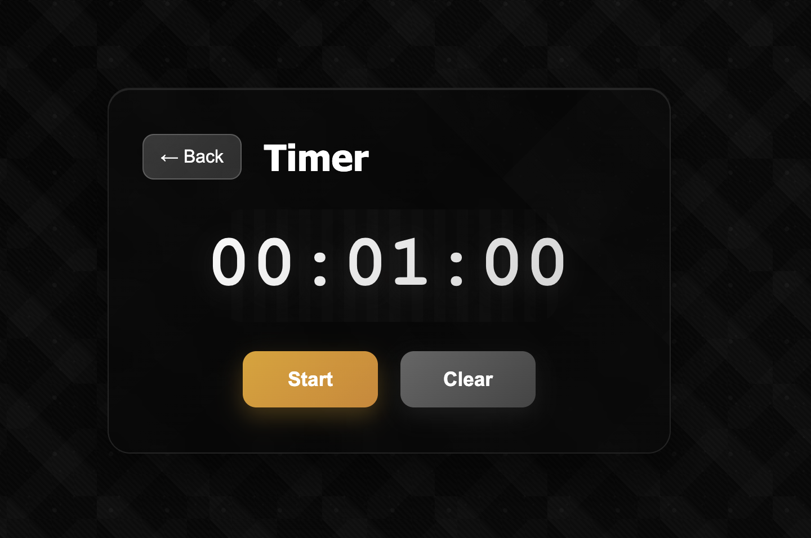
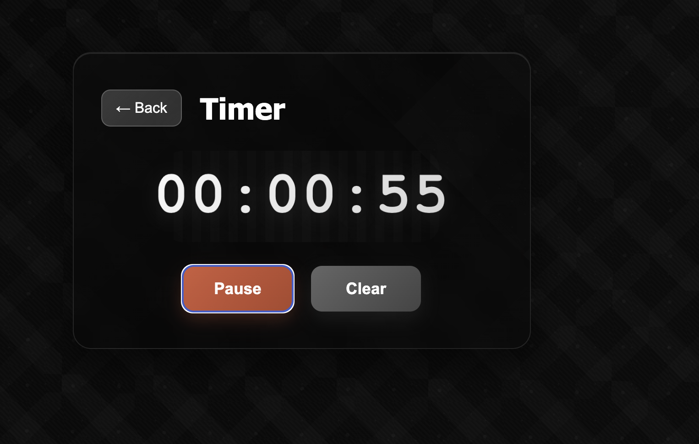
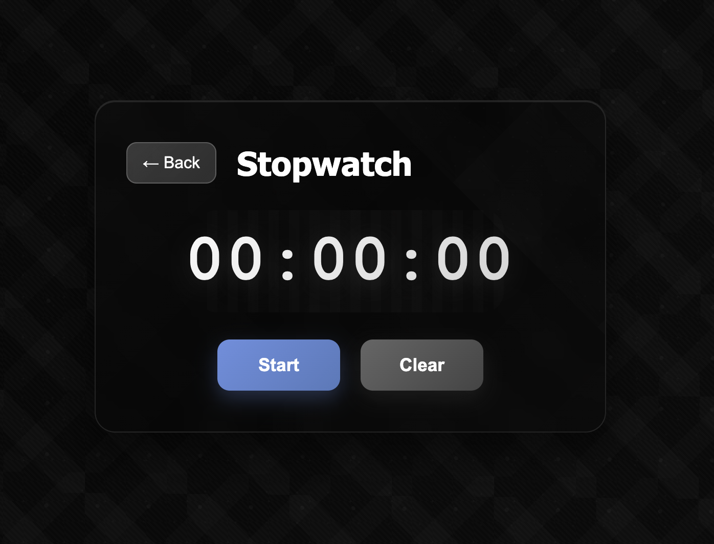
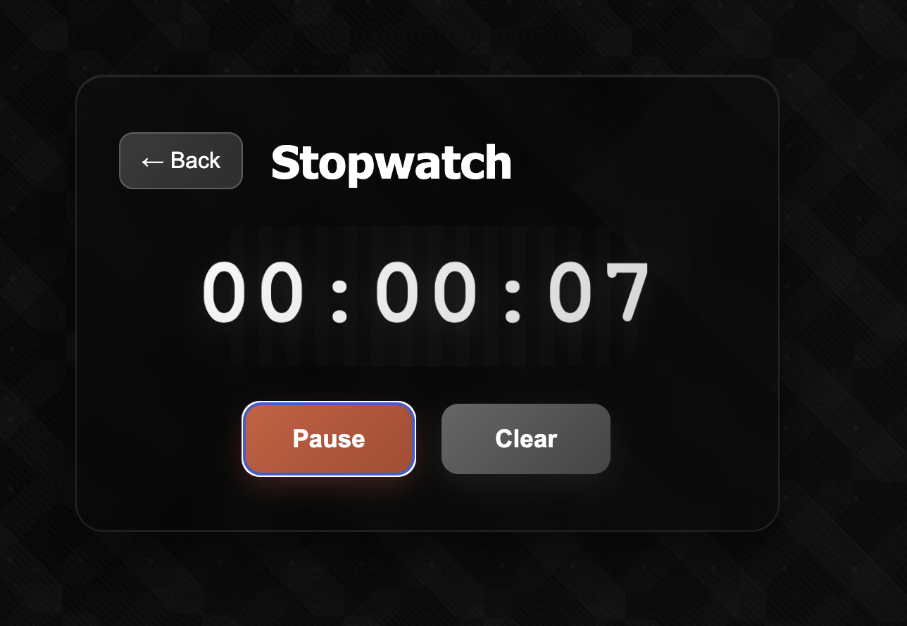
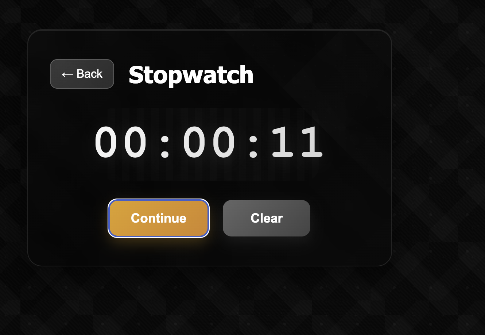

# ⏱️ Stopwatch & Timer - Motivational Time Keeper

A modern, elegant stopwatch and timer web application built with vanilla JavaScript, featuring a beautiful geometric design with motivational themes. Perfect for tracking your progress and challenging yourself to reach new heights.



## 🌟 Features

### ✅ **Stopwatch Functionality**
- **Precise Time Tracking**: Displays time in HH:MM:SS format
- **Dynamic Controls**: Start/Pause/Continue button that changes based on state
- **Clear Function**: Reset to 00:00:00 at any time
- **Visual Feedback**: Pulsing animation when active

### ⏰ **Timer Functionality**
- **Flexible Time Setting**: Set hours, minutes, and seconds separately
- **Countdown Display**: Clear HH:MM:SS countdown format
- **Smart Controls**: Context-aware Start/Pause/Continue/Clear buttons
- **Completion Alert**: Funny fart sound 💨 when timer reaches 00:00
- **Audio Fallback**: Web Audio API generates sound if no audio file available

### 🎨 **Modern Design**
- **Geometric Patterns**: Beautiful grayscale geometric backgrounds
- **Motivational Theme**: Mountain silhouettes and climbing imagery
- **Smooth Animations**: Slide transitions between pages
- **Responsive Design**: Works perfectly on desktop and mobile
- **Glassmorphism**: Modern blur effects and transparency

### 🏗️ **Technical Excellence**
- **SOLID Principles**: Clean, maintainable object-oriented architecture
- **Modular Design**: Separate classes for different responsibilities
- **Modern JavaScript**: ES6+ modules, classes, and async/await
- **No Dependencies**: Pure vanilla JavaScript, HTML, and CSS
- **Performance Optimized**: Hardware-accelerated animations

## 📱 Screenshots

### Home Page
The elegant landing page with motivational design and geometric patterns.


### Timer Functionality

#### Setting Timer
Input hours, minutes, and seconds with intuitive controls.



#### Timer Ready to Start
Clean interface showing set time with Start button.



#### Timer Running (Paused)
Active countdown with Pause state and Continue option.



### Stopwatch Functionality

#### Stopwatch Initial State
Clean 00:00:00 display ready to start timing.



#### Stopwatch Running (Paused)
Active timing with current time display and Pause state.



#### Stopwatch Continue State
Paused stopwatch with Continue option to resume timing.



## 🚀 How to Run

### Prerequisites
- Modern web browser (Chrome, Firefox, Safari, Edge)
- Python 3.x (for local server) or any HTTP server

### Quick Start

1. **Clone or Download** the repository
2. **Navigate** to the project directory:
   ```bash
   cd stopwatch-AMR
   ```

3. **Start a local server**:
   
   **Option A: Python HTTP Server**
   ```bash
   python3 -m http.server 8000
   ```
   
   **Option B: Node.js HTTP Server**
   ```bash
   npx http-server -p 8000
   ```
   
   **Option C: PHP Built-in Server**
   ```bash
   php -S localhost:8000
   ```

4. **Open your browser** and navigate to:
   ```
   http://localhost:8000
   ```

5. **Enjoy!** Start timing your activities and challenges! 🏔️

### Alternative: Direct File Access
You can also open `index.html` directly in your browser, but some features may be limited due to CORS restrictions.

## 🏗️ Architecture & Implementation

### SOLID Principles Implementation

#### **Single Responsibility Principle (SRP)**
- `TimeKeeper`: Base time management functionality
- `Stopwatch`: Counting up logic
- `Timer`: Countdown logic with completion handling
- `NavigationManager`: Page transitions and routing
- `SoundManager`: Audio playback functionality
- `App`: Application coordination and event handling

#### **Open/Closed Principle (OCP)**
- Easy to extend with new timer types by extending `TimeKeeper`
- New page types can be added to `NavigationManager`
- Sound effects can be extended in `SoundManager`

#### **Liskov Substitution Principle (LSP)**
- `Stopwatch` and `Timer` can be used interchangeably where `TimeKeeper` is expected
- Both implement the required `tick()` method with their specific behavior

#### **Interface Segregation Principle (ISP)**
- Classes only depend on methods they actually use
- `SoundManager` provides only audio-related functionality
- `NavigationManager` handles only navigation concerns

#### **Dependency Inversion Principle (DIP)**
- `App` class depends on abstractions (base classes) rather than concrete implementations
- Timer completion callback is injected as dependency

### File Structure
```
stopwatch-AMR/
├── index.html              # Main HTML structure
├── css/
│   └── style.css           # All styling and geometric patterns
├── js/
│   ├── TimeKeeper.js       # Base time management class
│   ├── Stopwatch.js        # Stopwatch implementation
│   ├── Timer.js            # Timer implementation
│   ├── NavigationManager.js # Page transitions
│   ├── SoundManager.js     # Audio handling
│   └── app.js              # Main application coordinator
└── assets/
    ├── images/             # Screenshots and documentation
    └── sounds/             # Audio files (optional)
```

### Key Technical Features

#### **Modern JavaScript (ES6+)**
- ES6 Modules for clean imports/exports
- Class-based object-oriented programming
- Arrow functions and template literals
- Async/await for audio handling
- Destructuring and spread operators

#### **Advanced CSS**
- CSS Grid and Flexbox for responsive layouts
- CSS Custom Properties (variables)
- Advanced animations with `@keyframes`
- Geometric patterns using gradients and SVG
- Backdrop filters for glassmorphism effects
- Hardware-accelerated transforms

#### **Web Audio API**
- Procedural fart sound generation
- Multiple oscillators for realistic audio
- Gain nodes for volume control
- Fallback sound generation
- Cross-browser compatibility

#### **Performance Optimizations**
- Hardware-accelerated CSS animations
- Efficient DOM manipulation
- Minimal reflows and repaints
- Optimized event listeners
- CSS-only geometric patterns (no images)

## 🎯 User Experience Features

### **Intuitive Controls**
- Context-aware button labels (Start/Pause/Continue)
- Visual feedback for all interactions
- Smooth page transitions
- Responsive touch targets

### **Visual Feedback**
- Pulsing animation for active timers
- Button state changes with colors
- Hover effects and micro-interactions
- Loading states and transitions

### **Accessibility**
- High contrast text and backgrounds
- Large, easy-to-read fonts
- Clear visual hierarchy
- Keyboard navigation support

### **Mobile Responsive**
- Optimized for all screen sizes
- Touch-friendly interface
- Adaptive layouts
- Performance optimized for mobile

## 🔧 Customization

### **Styling**
- Modify `css/style.css` to change colors, fonts, or layouts
- Geometric patterns can be adjusted in the CSS background properties
- Animation timings and effects are easily customizable

### **Functionality**
- Extend `TimeKeeper` class for new timer types
- Add new sound effects in `SoundManager`
- Implement new page types in `NavigationManager`

### **Audio**
- Replace fart sound with custom audio files
- Modify Web Audio API parameters for different sounds
- Add multiple sound options

## 🤝 Contributing

This project follows clean code principles and modern web development best practices. When contributing:

1. Follow the established SOLID principles
2. Maintain the modular architecture
3. Add appropriate documentation
4. Test across different browsers
5. Ensure responsive design compatibility

## 📄 License

This project is open source and available under the [MIT License](LICENSE).

## 🎉 Acknowledgments

- Inspired by modern fitness and productivity apps
- Geometric design patterns from contemporary UI trends
- Motivational themes to encourage personal growth and achievement

---

**Built with ❤️ and modern web technologies**

*Push your limits, track your progress, and reach new heights! 🏔️*
