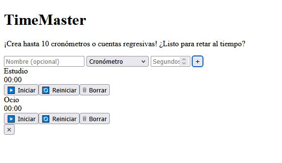
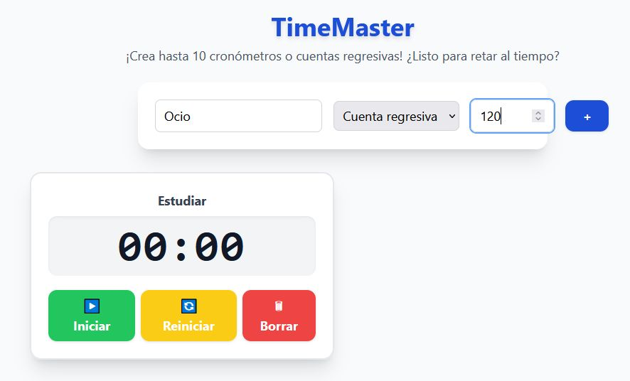
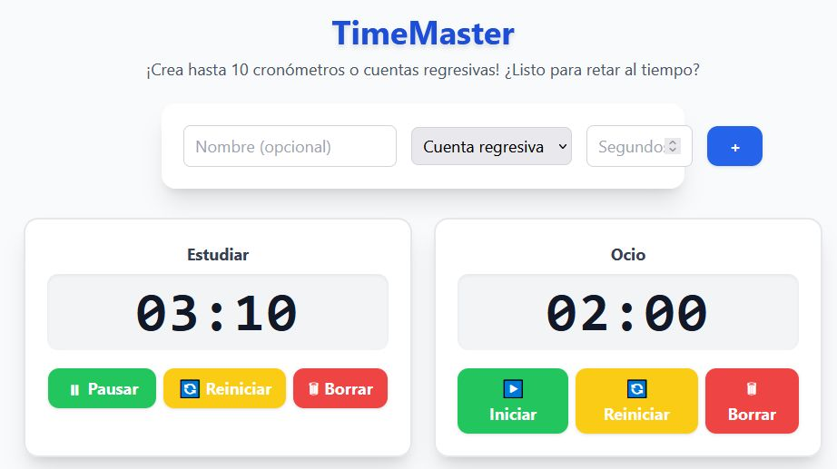
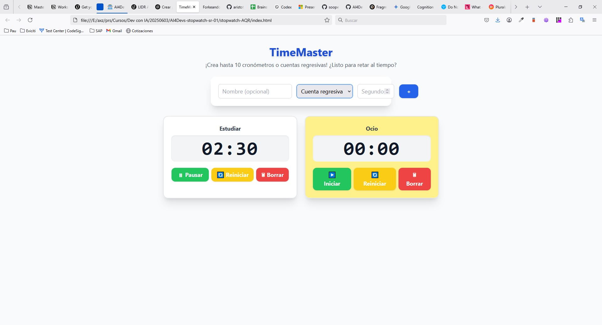
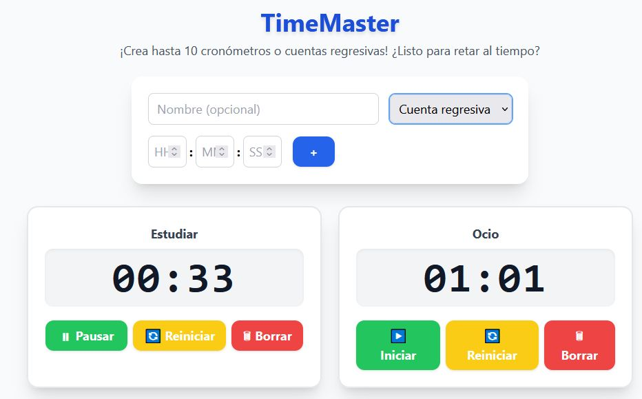
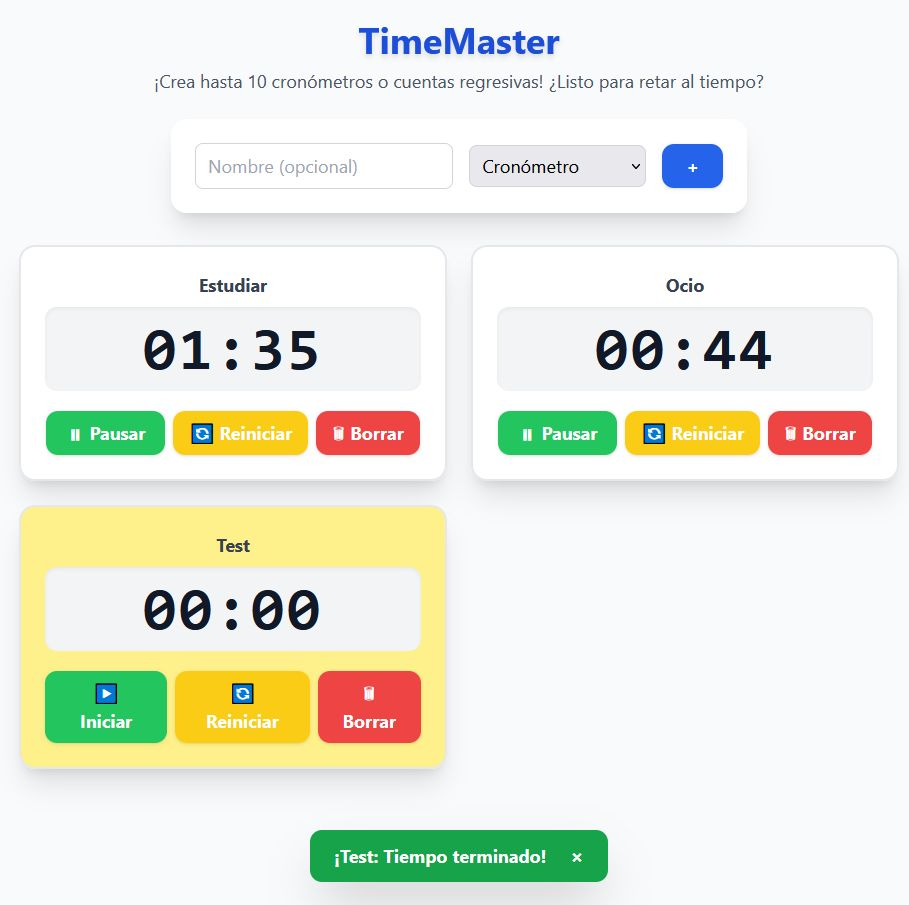

# Prompt inicial con justificación:
Considerando este prompt:
>Crea una página web que invierta una cadena de texto escrita por el usuario, siguiendo estos criterios de aceptación:
>Criterios técnicos:
>  Separa el código HTML y JavaScript en index.html y script.js.
>  Usa JavaScript sin bibliotecas (JS Vanilla).
>  Aplica los principios SOLID.
>  Implementa todos los registros necesarios en la consola.
>  Maneja todas las posibles excepciones.
>  Para el CSS usa Tailwind.
>  Haz que la página sea responsive.
>
>Criterios funcionales:
>  Habrá un campo de texto para escribir la cadena a invertir y un botón para activar la acción de inversión.
>  La longitud mínima será de 3 caracteres y la máxima de 20.
>  Si no se cumplen los criterios de longitud mínima y máxima, marca el campo de entrada con el estilo más apropiado de Tailwind y muestra una alerta de error con el mensaje correspondiente.
>  Si el texto proporcionado es válido:
>    Inviértelo y muéstralo debajo del campo de entrada, aplicando el estilo que consideres apropiado.
>    Muestra una alerta de éxito.
>    Limpia el campo de entrada.
>    Esconde el texto invertido y la alerta de éxito después de 10 segundos para que se pueda usar de nuevo.
>  La acción de inversión también se podrá activar con la tecla Enter/Return.
>
>Criterios generales:
>  Agrega un título y una descripción atractivos y divertidos.

Ayúdame a escribir un nuevo prompt con el mismo estilo, alcance y criterios para desarrollar un cronómetro y una cuenta regresiva que cumpla con lo siguiente:
* Al finalizar una cuenta regresiva, muestra una notificación y reproduce un sonido de alerta.
* Ofrece la posibilidad de crear y gestionar múltiples cronómetros o cuentas regresivas simultáneamente.
* Tenga apariencia similar a la imagen que te subiré

# Debes explicar qué estrategia de prompting elegiste, por qué estructuraste los prompts de una u otra manera y qué tipo de consideraciones tuviste en cuenta al hacerlo (por ejemplo, nivel de detalle, contexto, iteraciones, etc.).
Aunque me gustó mi prompt del ejercicio pasado y me dio resultados aceptables, el que usaron para resolverlo, me pareció bastante más profesional el resultado, además de ser más específico y considerar el tema visual, por lo que decidí usar meta-prompting y pedirle al mismo Chat GPT me ayudara a generar un prompt de calidad similar.  Sabía que iba a iterar más, pero quería experimentar VS el anterior y el resultado, me gustó mucho.

# Resultados parciales con errores o fallos detectados y Refinamientos aplicados
Uní ambos puntos para hacerlo a manera de historia.
1. Este fue el primer propmpt refinado que se construyó con meta-prompting:
```
Crea una página web que permita crear, gestionar y visualizar cronómetros y cuentas regresivas simultáneamente, siguiendo estos criterios de aceptación:
Criterios técnicos:
    Separa el código HTML y JavaScript en index.html y script.js.
    Usa JavaScript puro (Vanilla JS).
    Aplica los principios SOLID.
    Implementa todos los registros necesarios en la consola.
    Maneja todas las posibles excepciones.
    Para los estilos utiliza Tailwind.
    Asegúrate de que el sitio sea responsive y se vea bien en diferentes dispositivos.
Criterios funcionales:
    Permite al usuario crear múltiples cronómetros y/o cuentas regresivas de manera simultánea, pudiendo gestionar (iniciar, pausar, reanudar, reiniciar y eliminar) cada uno por separado.
    Ofrece campos claros para nombrar y establecer el tiempo inicial de cada cronómetro o cuenta regresiva.
    Muestra una notificación visual y reproduce un sonido de alerta cuando finaliza una cuenta regresiva.
    Permite detener el sonido de alerta fácilmente después de que suene.
    Los cronómetros y cuentas regresivas deben mostrarse en una lista o cuadrícula, cada uno con controles individuales.
    Al menos una acción (por ejemplo, iniciar o pausar) debe poder realizarse también con la tecla Enter/Return cuando un elemento está enfocado.
    El estado y configuración de los cronómetros/cuentas regresivas debe persistir si el usuario recarga la página (usa localStorage o equivalente).
Criterios generales:
    Agrega un título y una descripción atractivos y divertidos.
    La apariencia debe ser similar a la imagen de referencia que te proporcionaré.
Pídeme cualquier información extra que necesites antes de comenzar a desarrollarla.
```
2. Me pidió cargar la imagen (¿Te gustaría agregar o cambiar algo antes de que lo usemos? Cuando subas la imagen, integramos los detalles visuales que consideres importantes.)
3. Generó éste prompt (solo lo modifiqué para darle estructura tipo MarkDown, conforme a la recomendación en una de las lecturas):
```
Crea una página web que permita crear, gestionar y visualizar cronómetros y cuentas regresivas simultáneamente, siguiendo estos criterios de aceptación:
#Criterios técnicos:
* Separa el código HTML y JavaScript en index.html y script.js.
* Usa JavaScript puro (Vanilla JS).
* Aplica los principios SOLID.
* Implementa todos los logs necesarios en la consola.
* Maneja todas las posibles excepciones.
* Para los estilos utiliza Tailwind.

    Asegúrate de que el sitio sea responsive y se vea bien en diferentes dispositivos.

#Criterios funcionales:
* Permite al usuario crear múltiples cronómetros y/o cuentas regresivas de manera simultánea, pudiendo gestionar (iniciar, pausar, reanudar, reiniciar y eliminar) cada uno por separado.
* Cada cronómetro/cuenta regresiva debe tener campos claros para nombrar y establecer el tiempo inicial.
* El diseño visual de cada cronómetro/cuenta regresiva debe inspirarse en la imagen proporcionada (display digital grande, fondo claro, bordes redondeados, botones grandes de “Start” en verde y “Clear” en rojo, tipografía clara y grande).
* Cuando una cuenta regresiva finalice, muestra una notificación visual y reproduce un sonido de alerta. Permite detener el sonido fácilmente.
* Los cronómetros y cuentas regresivas deben mostrarse en una lista o cuadrícula, cada uno con controles individuales.
* Al menos una acción (por ejemplo, iniciar o pausar) debe poder realizarse también con la tecla Enter/Return cuando el elemento tiene el foco.

#Criterios generales:
* Agrega un título y una descripción atractivos y divertidos.
* El diseño general (disposición, colores, tamaños de texto y botones) debe seguir la referencia visual que te proporcioné en la imagen adjunta.

Pídeme cualquier información extra que necesites antes de comenzar a desarrollarla.
```
4. Me lanzó estas preguntas:
* ¿Quieres que el usuario pueda alternar entre cronómetro (que cuenta hacia arriba) y temporizador/cuenta regresiva (que cuenta hacia abajo) en cada tarjeta, o cada uno es un tipo diferente de elemento?
* ¿El nombre que el usuario ingresa es opcional u obligatorio?
* ¿El sonido de alerta debe ser alguno en particular o uno simple (como beep)? ¿Prefieres que lo genere con JS o subirás un archivo propio?
* ¿Hay límite de cuántos cronómetros o cuentas regresivas se pueden crear a la vez?
* ¿Te gustaría alguna animación o efecto visual cuando termine la cuenta regresiva (por ejemplo, que parpadee el display o algo así)?
* ¿La notificación visual debe ser un modal, un toast, o un mensaje arriba/abajo del display?
* ¿Hay alguna fuente/tipografía que prefieras o puede ser la predeterminada de Tailwind?
* ¿Quieres que al actualizar la página todo permanezca igual (persistencia con localStorage) o se puede limpiar todo?
Mis respuestas:
* Que pueda alternar
* El nombre es opcional
* Con un beep generado con JS es suficiente
* Máximo 10
* Que parpadee
* Toast
* La predeterminada de Tailwind
* Que se limpie todo
ChatGPT:
	Resumen de requerimientos (para el arranque):
			Alternar entre cronómetro y cuenta regresiva en cada tarjeta.
			Nombre opcional.
			Sonido de “beep” generado por JS.
			Máximo 10 elementos a la vez.
			Al finalizar la cuenta regresiva: parpadeo del display y toast de alerta.
			Persistencia solo en memoria (al recargar, se limpia todo).
			Tipografía predeterminada de Tailwind.
			Diseño inspirado en la imagen.
			Responsive.
			Separación de archivos (index.html, script.js).
			JS Vanilla, principios SOLID, logs y manejo de excepciones.
	¿Listo para que te comparta la estructura de archivos y el primer borrador del HTML con los estilos base inspirados en tu imagen? ¿O quieres que comience con la lógica de JS?
	Tú dime cómo prefieres avanzar: de poco en poco (paso a paso, revisando cada cosa) o todo junto (código de base completo para irlo afinando).
Respondí: Todo junto
5. La visualización era fea, se veía así:

6. Se revisó el código y se detectó que la URL estaba rota, se le indicó:
```
parece que la url: https://cdn.jsdelivr.net/npm/tailwindcss@3.4.1/dist/tailwind.min.css
no es válida, podrías corregirla? el navegador devuelve el mensaje: Couldn't find the requested file /dist/tailwind.min.css in tailwindcss.
```
7. Comentó:
```
¡Buena observación!
Esa URL no funciona porque Tailwind no distribuye CSS precompilado por CDN.
Para prototipos, puedes usar Tailwind Play CDN, que sí compila estilos en tiempo real (¡perfecta para este caso!):
```
8. Se aplicaron las sugerencias de código y ahora se veía mucho mejor:

Sin embargo, no me gustaba del todo puesto que se desbordaba:

Pero funcionaba y visualmente era mucho mejor, incluso al terminar el timer:

9. Le indiqué el tema del desbordamiento y le pedí que separara el temporizador:
```
Ya quedó esa parte, ahora, cuando elijo cuenta regresiva, el re-cuadro para el tiempo, se desborda, además me gustaría que tuviera un selector de horas, minutos y segundos en lugar de solo segundos.  Puedes modificar para corregir y estructurarlo de ése modo?
```
10. Me indicó cambios por separado, los apliqué y no funcionaron, le indiqué:
```ya no funciona, no agrega los timers```
11. Me sugirió nuevos cambios que ahora si funcionaron, mostraba el timer:

Y todo funcionaba como lo imaginé:


# Prompt final (también colócalo en el comentario del Pull Request)
Aunque sería una mezcla de los ajustes, el final inicial fue este:
```
Crea una página web que permita crear, gestionar y visualizar cronómetros y cuentas regresivas simultáneamente, siguiendo estos criterios de aceptación:
#Criterios técnicos:
* Separa el código HTML y JavaScript en index.html y script.js.
* Usa JavaScript puro (Vanilla JS).
* Aplica los principios SOLID.
* Implementa todos los logs necesarios en la consola.
* Maneja todas las posibles excepciones.
* Para los estilos utiliza Tailwind.

    Asegúrate de que el sitio sea responsive y se vea bien en diferentes dispositivos.

#Criterios funcionales:
* Permite al usuario crear múltiples cronómetros y/o cuentas regresivas de manera simultánea, pudiendo gestionar (iniciar, pausar, reanudar, reiniciar y eliminar) cada uno por separado.
* Cada cronómetro/cuenta regresiva debe tener campos claros para nombrar y establecer el tiempo inicial.
* El diseño visual de cada cronómetro/cuenta regresiva debe inspirarse en la imagen proporcionada (display digital grande, fondo claro, bordes redondeados, botones grandes de “Start” en verde y “Clear” en rojo, tipografía clara y grande).
* Cuando una cuenta regresiva finalice, muestra una notificación visual y reproduce un sonido de alerta. Permite detener el sonido fácilmente.
* Los cronómetros y cuentas regresivas deben mostrarse en una lista o cuadrícula, cada uno con controles individuales.
* Al menos una acción (por ejemplo, iniciar o pausar) debe poder realizarse también con la tecla Enter/Return cuando el elemento tiene el foco.

#Criterios generales:
* Agrega un título y una descripción atractivos y divertidos.
* El diseño general (disposición, colores, tamaños de texto y botones) debe seguir la referencia visual que te proporcioné en la imagen adjunta.

Pídeme cualquier información extra que necesites antes de comenzar a desarrollarla.
```

# Breve explicación de por qué el último prompt funcionó mejor
En mi caso fui refinando los ajustes no fue un solo prompt
