1.Prompt inicial con justificación:
    1.1 Debes explicar qué estrategia de prompting elegiste, 
    escogi la estrategia few-shot prompting, porque se requeria incluir diferentes contextos, la url de la pagina oficial con la funcionalidad
    adicionalmente me ví en la obligación de agregar mas imagenes, ya que no lo logre con solo una imagen mas la pagina. 

2. Resultados parciales con errores o fallos detectados

**prompt mas o menos cocinado pero con fallos**

# Role eres un experto fullstack JS developer 
# Objetivo desarrollar un **cronómetro** y una **cuenta regresiva.**  
teniendo como guia de diseño Referencia visual: [🔗 Online Stopwatch](https://www.online-stopwatch.com/) y 
la imagen adjunta. El código final debe generar 2 archivos separados: index.html y script.js (sin frameworks).

##1 Criterios Técnicos para Implementar la Solución

### 1.1 **Arquitectura y Estructura de Archivos**

**index.html**
* Contendrá la estructura básica: cabecera, contenedor del cronómetro, y botones.

**script.js**
* Contendrá la lógica para el cronómetro y la cuenta regresiva.   
* Se enlazará en `index.html` con ``.
    
### 1.2 **Interfaz de Usuario (UI)**

**Diseño similar al sitio de referencia**:
* Gran pantalla de dígitos (`00:08:00`).  
* Dos botones grandes: **Start (verde)** y **Clear (rojo)**.
* Estilos sencillos y bien contrastados.
* Tenre
    
**Accesibilidad**:
* Uso de colores accesibles con suficiente contraste.  
* Atributos `aria` y etiquetas claras.
    
### 1.3 **Funcionalidades Principales**

**Cronómetro**:
* Mostrar tiempo en formato `HH:MM:SS`.  
* Función de Start/Pause/Resume.  
* Reset.
    
**Cuenta regresiva**:
* Permitir configurar el tiempo inicial.  
* Contador hacia atrás, con alerta sonora o visual al llegar a cero.
    
### 1.4 **Buenas Prácticas de Desarrollo**

**Separación de responsabilidades**:
* HTML para estructura.
* CSS para estilos (opcional en este caso, puede estar embebido o en el HTML).
* JS para la lógica.
    
**Responsive Design**:
* Ajustar el tamaño de la pantalla según el dispositivo.

**Compatibilidad**:
* Evitar Flash o tecnologías obsoletas.  
* Usar JavaScript moderno (ES6+).
    
**Uso de `requestAnimationFrame` o `setInterval`**:
* Para un cronómetro preciso y eficiente.
    
### 1.5 **Extensibilidad**

* Fácil de extender en el futuro:
* Agregar alarmas.  
* Sonidos.  
* Otras características como vueltas (laps).

##2 Plan de Implementación

###2.1 index.html
* Encabezado básico: `<title>Cronómetro y Cuenta Regresiva</title>`.  
* Contenedor para el tiempo.  
* Botones Start y Clear.  
* Referencia al archivo `script.js`.
   
###2.2 script.js

* Variables de estado: tiempo actual, estado de ejecución.
* Funciones para Start/Pause/Resume y Clear.  
* Lógica para cambiar entre cronómetro y cuenta regresiva (puede ser una simple bandera de modo).

##3 Buenas Prácticas de Programación

###3.1 Principios SOLID

- **S: Single Responsibility Principle**
  - Cada módulo (o función) debe tener una única responsabilidad.
  - Ejemplo: un módulo para el manejo del tiempo, otro para la interfaz.

- **O: Open/Closed Principle**
  - Abierto a extensiones, cerrado a modificaciones.
  - Ejemplo: posibilidad de agregar alarmas o vueltas sin romper la lógica base.

- **L: Liskov Substitution Principle**
  - Permitir que clases hijas sustituyan a las clases padres sin problemas.
  - Ejemplo: `Timer` base y herencias específicas para cronómetro o cuenta regresiva.

- **I: Interface Segregation Principle**
  - Evitar forzar a los módulos a usar métodos que no necesitan.
  - Ejemplo: separar interfaz básica (start/clear) de funciones avanzadas (laps).

- **D: Dependency Inversion Principle**
  - Depender de abstracciones y no de implementaciones concretas.
  - Ejemplo: manejar eventos de UI mediante interfaces en lugar de elementos directos del DOM.

##4 Buenas prácticas generales

- Modularización y reutilización de código.
- Uso de `const` y `let` en lugar de `var`.
- Uso de funciones puras siempre que sea posible.
- Documentación en comentarios y/o docstrings.
- Evitar valores hardcodeados: usar constantes configurables.
- Manejo de errores y validaciones.
- Separación de responsabilidades (MVC si aplica).
- Uso de plantillas literales y funciones flecha cuando sea apropiado.
- Evitar código duplicado.

##5 Testing y TDD

###5.1 Estrategia TDD:
1. **Red**: Escribir una prueba que falle.
2. **Green**: Implementar la funcionalidad mínima que pase la prueba.
3. **Refactor**: Mejorar el código manteniendo las pruebas verdes.

###5.2 Herramientas sugeridas:
- Jest (recomendado para JS puro).
- Alternativas: Vitest, Mocha + Chai.

###5.3 Qué probar:
- Inicialización: tiempo en cero o valor inicial correcto.
- Start/Pause: inicio y pausa del tiempo.
- Clear: reinicio del tiempo.
- Cambio de modos (cronómetro ↔ cuenta regresiva).
- Alertas Sonoras y notificaciones al llegar a 0 (en cuenta regresiva).

##6 Estructura de proyecto recomendada

/project-root
  ├── index.html
  ├── script.js
  ├── style.css (opcional)
  ├── /tests
       └── timer.test.js
  └── package.json (si usas npm)

**fallo prompt 1**

una vez implementado la solución muestra el desarrollo unicamente del cronometro
sin la cuenta regresiva, esto se debe a la misma forma en que se solicito desarrollar
por lo tanto se debe ser bastante mas especifico.

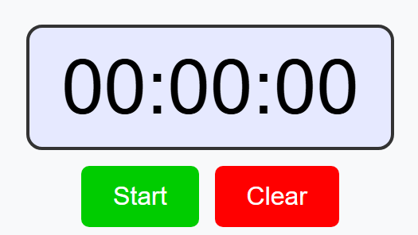

3. Refinamientos aplicados

**en la barra azul inferior no se ve bien el texto**

**ajusta el tamaño de la barra inferior para que quede igual que la superior en tamaño y anchura**

**antes del texto back agrega la imagen bk.jpg**

**en la sección countdown no puedo agregar el tiempo en numero algo paso y solo permite una entrada**

4. Prompt final (también colócalo en el comentario del Pull Request)

# Role eres un experto fullstack JS developer 
# Objetivo desarrollar un **Stopwatch** y un **Countdown**  

visita la pagina **[Online-Stopwatch](https://www.online-stopwatch.com/)** y obten todos los estilos css y la logica js.
Usa las imagenes ppal.jpg (pagina principal), stop.jpg(stopwatch), count.jpg(countdown) como referencia para desarollar

El código final debe generar en solo 2 archivos separados: index.html (con el UI y los estilos embebidos) y la lógica en script.js (sin frameworks).

#1. Criterios Técnicos para Implementar la Solución

*   Utilizar únicamente **HTML**, **CSS embebido** en el archivo `index.html`, y **JavaScript puro** en `script.js`.
    
*   Reproducir fielmente la estética y funcionalidad del sitio original [Online-Stopwatch](https://www.online-stopwatch.com/).
    
*   Emplear las imágenes de referencia: `ppal.jpg`, `stop.jpg`, `count.jpg` para guiar el diseño visual.
    
*   Incluir los íconos de flechas (`up.jpg`, `down.jpg`) y botón de volver (`bk.jpg`) desde la carpeta `img/`.
    
*   El diseño debe estar centrado en pantalla, con un layout limpio y alineado.
    
*   Componentes principales:
    *   Página principal con dos botones de navegación.
        
    *   Sección `Stopwatch` con cronómetro de milisegundos y controles.
        
    *   Sección `Countdown` con ingreso numérico, controles y cronómetro.

*   Se debe contemplar que la pagina en general tenga diseño reponsivo y se adapte a diferentes dispositivos y tamaños

        

* * *

#2. Plan de Implementación
-------------------------

1.  **Estructura de Archivos:**
    *   `index.html`: Contendrá todo el HTML y los estilos CSS embebidos.
        
    *   `script.js`: Contendrá toda la lógica JavaScript para manejar la navegación y funcionalidades.
        
2.  **Desarrollo por Secciones:**
    *   **Página Principal (ppal.jpg)**:
        *   Dos botones grandes con flechas (verde izquierda = Stopwatch, roja derecha = Countdown), que se mantienen por dentro de 
            la sección, sin salirce de los bordes a un margen de 0.7.

        *   Efecto hover de resaltado cuando pase el mouse por el boton de color verde muy claro solo en la **sección completa**, no 
            en la flecha.
            
        *   Barras azules superior e inferior de igual altura,  grosor y tamaño, muy cercanas a los botones. deben ser de igual 
            grosor. (aqui la barra azul inferior no debe tener botones ni letras)
            
        *   Layout centrado y exacto al diseño de la imagen de referencia ppal.jpg.
            
    *   **Stopwatch (stop.jpg)**:
        *   Barras azules superior e inferior de igual altura, grosor y tamaño (sobre la barra azul inferior incluir un texto que 
            diga back en letras blancas alineado a la izquierda y que retorne a la pagina de inicio).
            
        *   Cronómetro con visualización HH:MM:SS y mostrar milisegundos en tres dígitos alineado a la derecha debajo de los SS, el 
            tamaño de la fuente debe ser la tercera parte de los SS.
        
        *   Todas el texto de los botones deben poder verse dentro del boton y de facil lectura 
            
        *   Botones iniciales `Start` y `Clear`.

        *   En caso que se de clic en Start debe debe aparecer el cronometro en el mismo formato pero 2 botones grandes debajo uno 
            con Pausa y otro con clear

        *   En el caso que se de clic en Pausa debe debe aparecer el cronometro en el mismo formato pero 2 botones grandes debajo 
            uno con Continue y otro con clear

        *   En caso que se de clic en Continue debe debe aparecer el cronometro en el mismo formato pero 2 botones grandes debajo 
            uno con Pausa y otro con clear

        *   El cronometro debe ser 100% igual a la imagen stop.jpg incluyendo los bordes de los botones, el fondo del cronometro.
            
    *   **Countdown (count.jpg)**:
        *   Misma estructura de barras azules que Stopwatch.
            
        *   Cronómetro con visualización HH:MM:SS y mostrar milisegundos en tres dígitos debajo de los SS, el tamaño de la fuente de 
            debe ser la mitad de los SS.

        *   Todas el texto de los botones deben poder verse dentro del boton y de facil lectura 
            
        *   Botonera Inicial con números del 0 al 4 y Clear en la primera fila, luego en la segunda fila encima de esta agregar los 
            botones del 5 al 9 y Set 100% igual a la imagen count.jpg

        *   En caso que se de clic en el boton set debe aparecer el cronometro en le mismo formato pero 2 botones grandes debajo uno 
            con start y otro con clear

        *   En caso que se de clic en el boton start debe aparecer el cronometro en le mismo formato pero 2 botones grandes debajo 
            uno con pause y otro con clear
       
        *   En caso que se de clic en el boton pause debe aparecer el cronometro en le mismo formato pero 2 botones grandes debajo 
            uno con continue y otro con clear

        *   Al finalizar el tiempo debe mostrar una alerta parpadeante de color rojo muy claro sobre el cronometro y emitir un 
            sonido beep importado desde internet
            
        *   Disposición en dos filas como en la referencia. 100% igual a la imagen count.jpg

        *   El cronometro debe ser 100% igual a la imagen count.jpg incluyendo los bordes de los botones, el fondo del cronometro.
            
#3.  **Navegación:**
    *   Mostrar/ocultar secciones mediante JavaScript.
        
    *   Volver a la pagina inicio al dar clic en el botón `back`.
        

* * *

#3. Buenas Prácticas de Programación
-----------------------------------

*   Separación clara de responsabilidades: UI y lógica en archivos distintos.
    
*   Semántica HTML respetada (uso de `main`, `section`, `button`, etc.).
    
*   Código CSS estructurado y legible con comentarios descriptivos.
    
*   Código JS modularizado por funciones (ej. `startStopwatch()`, `pauseCountdown()`).
    
*   Variables y funciones nombradas descriptivamente en inglés.
    

### 3.1 Principios SOLID

*   **S**: Single Responsibility - Cada función debe tener una única responsabilidad clara.
    
*   **O**: Open/Closed - El código debe permitir extensión sin modificar las partes estables.
    
*   **L**: Liskov Substitution - Las funciones deben poder usarse de forma predecible sin romper la lógica.
    
*   **I**: Interface Segregation - Separar funcionalidades por contexto (Stopwatch vs Countdown).
    
*   **D**: Dependency Inversion - Mantener acoplamiento bajo entre estructura HTML y lógica JS.
    

* * *

#4. Buenas Prácticas Generales
-----------------------------

*   Layout centrado con medidas fijas para los botones (220x220 px).
    
*   Barras azules ajustadas al ancho del contenedor.
    
*   Separación mínima entre cronómetro/botones y barras azules.
    
*   Interfaz accesible y visualmente clara.
    
*   Uso de clases y selectores reutilizables.
    

* * *

#5. Testing y TDD
----------------

*   Probar navegación entre vistas (principal, stopwatch, countdown).
    
*   Validar funcionamiento correcto de los botones (`Start`, `Pause`, `Clear`, etc.).
    
*   Simular escenarios de uso y verificar que el tiempo transcurre correctamente.
    
*   Testear condiciones límite (ej. cuenta regresiva desde 0).
    
*   Aunque TDD completo es limitado sin frameworks, se puede:
    *   Crear funciones puras testeables (sin manipulación directa del DOM).
        
    *   Usar logs en consola para validar ciclos y controles.

5. Breve explicación de por qué el último prompt funcionó mejor

-- **evidencias del resultado final funcionando - alcanzando los objetivos** :-)
-- estas son las imagenes que se ven como desordenadas, pero la verdad que es importante para mi mostrar evidencia.

**1 pagina principal**

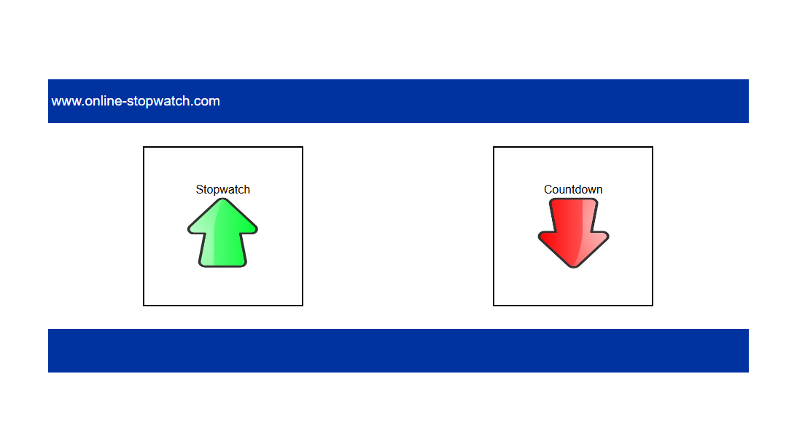

**2 stopwatch**

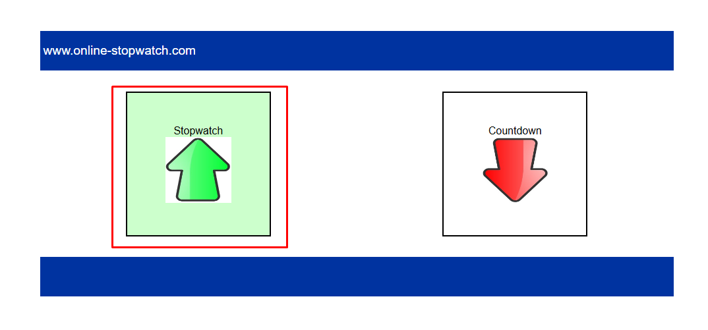

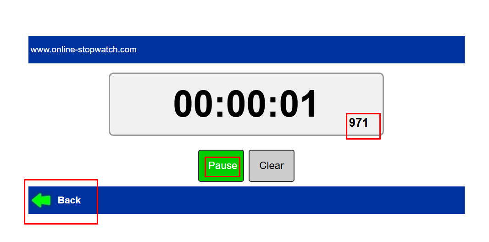

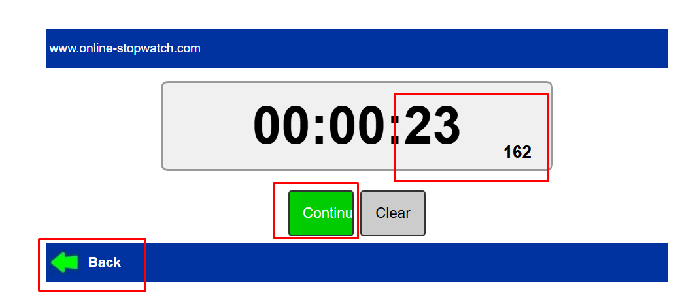

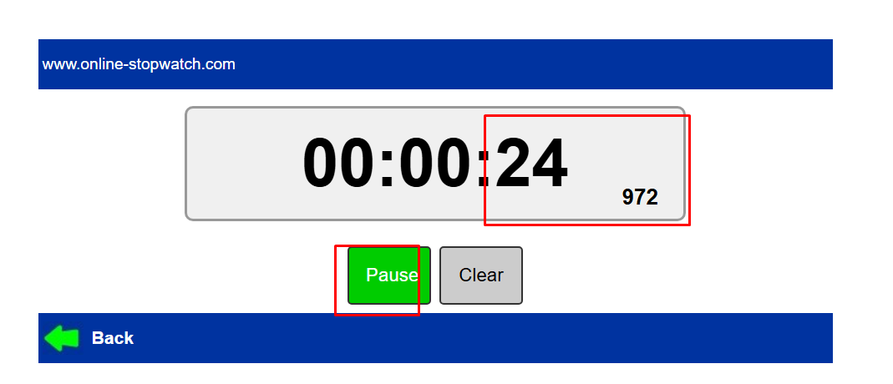

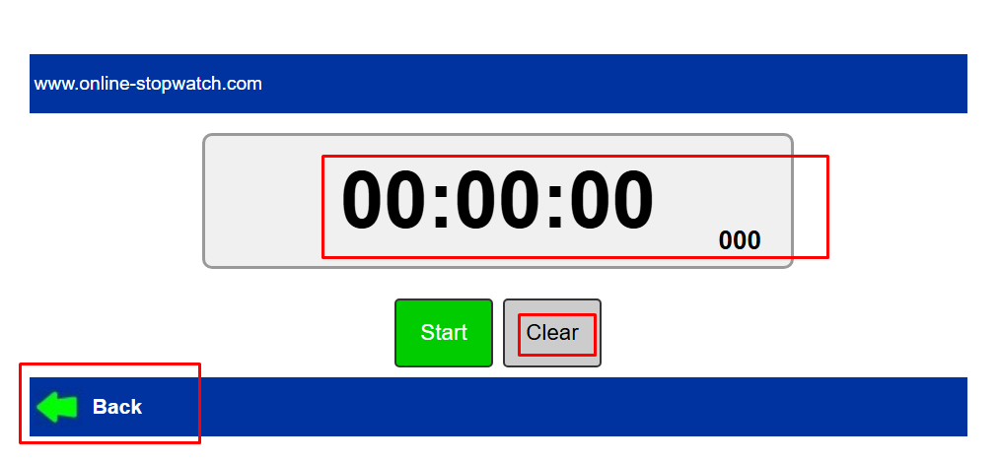

**3 countdown**

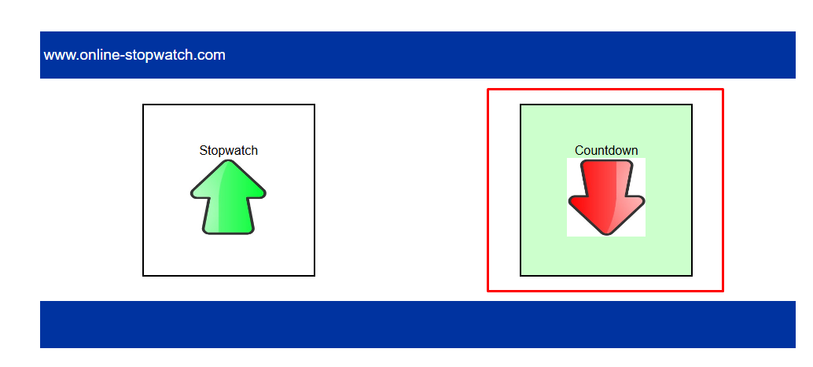

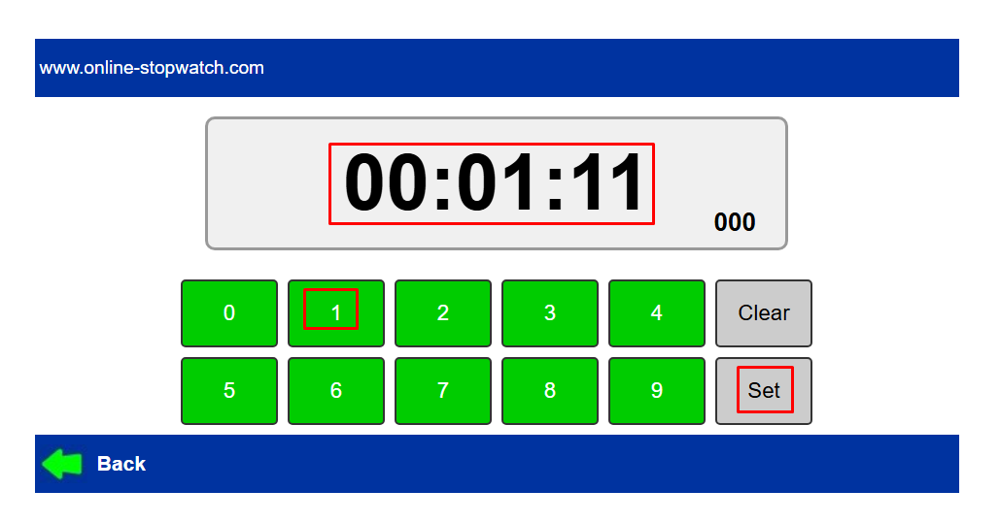

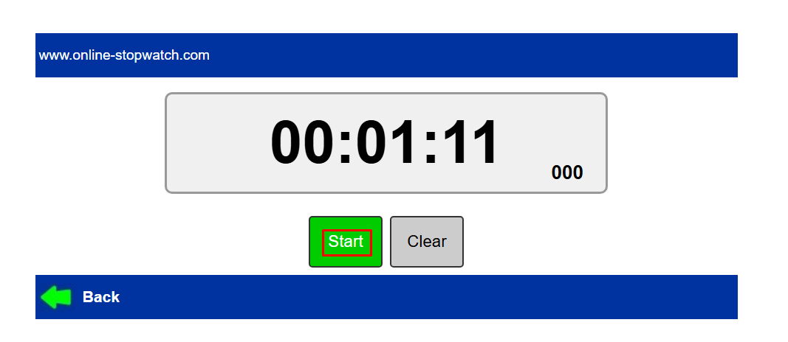

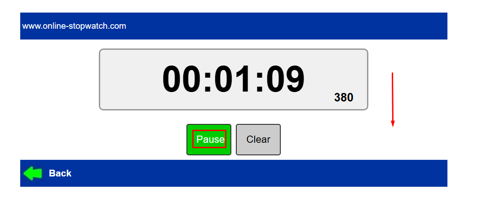

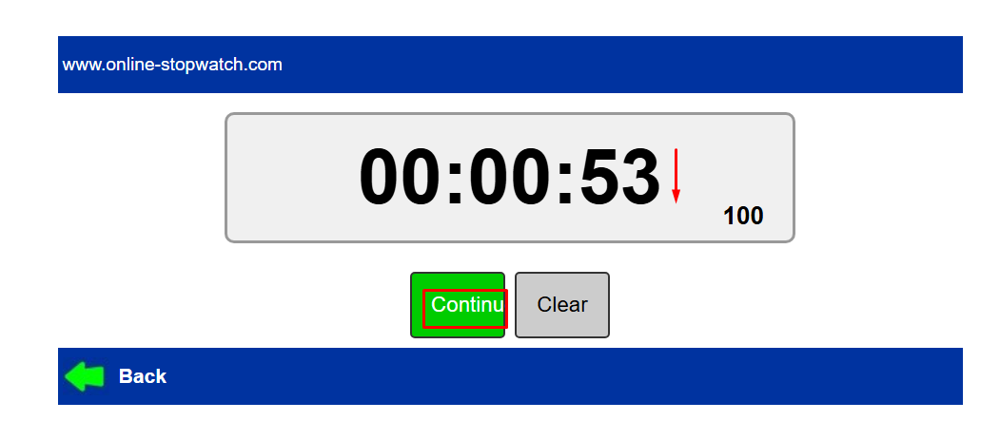

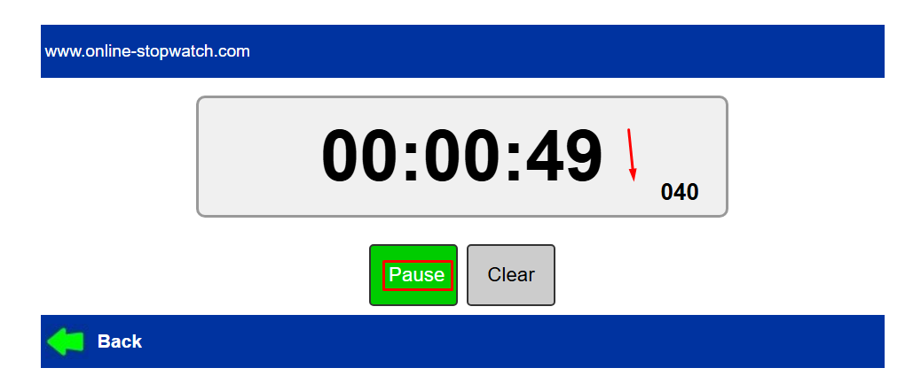

alerta con sonido

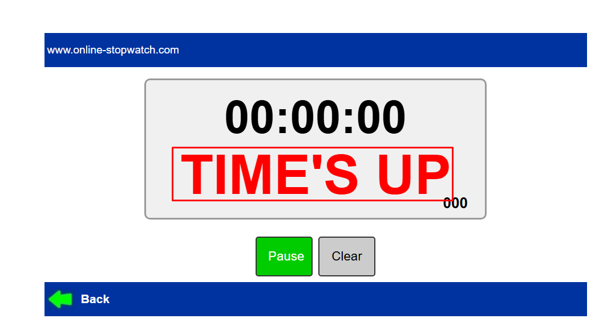